#  Atelier Sécurité des Endpoints - Wazuh SIEM/EDR

> **Supervision SIEM et EDR avec Wazuh**  
> Étude de cas multi-OS (Linux & Windows) sur AWS


##  Table des matières

- [Introduction](#introduction)
- [Architecture de la solution](#architecture-de-la-solution)
- [Déploiement de l'infrastructure](#déploiement-de-linfrastructure)
- [Enrôlement des clients](#enrôlement-des-clients)
- [Démonstrations SIEM et EDR](#démonstrations-siem-et-edr)
- [Conclusion](#conclusion)

---

##  Introduction

### Contexte du projet

Dans le contexte actuel de cybersécurité, les organisations doivent faire face à des menaces de plus en plus sophistiquées. La mise en place d'une plateforme de supervision complète combinant les capacités **SIEM** (Security Information and Event Management) et **EDR** (Endpoint Detection and Response) est devenue essentielle pour détecter, analyser et répondre aux incidents de sécurité.

Ce projet vise à déployer une infrastructure complète de sécurité basée sur **Wazuh**, une solution open-source reconnue, sur la plateforme cloud **Amazon Web Services (AWS)**.

### Objectifs de l'atelier

- **Déployer une architecture SIEM/EDR complète** sur AWS avec Wazuh
- **Superviser des endpoints multi-OS** (Linux Ubuntu et Windows Server)
- **Générer et analyser des événements de sécurité** en temps réel
- **Comprendre les mécanismes de détection** des menaces
- **Acquérir une vision opérationnelle** d'un SOC moderne

### Technologies utilisées

| Composant | Technologie |
|-----------|-------------|
| **Cloud Provider** | AWS (Amazon Web Services) |
| **Solution SIEM/EDR** | Wazuh 4.14 |
| **Serveur** | Ubuntu 22.04 LTS |
| **Clients** | Ubuntu 22.04 LTS + Windows Server 2022 |
| **Composants Wazuh** | Manager, Indexer, Dashboard |

### Axes de cybersécurité couverts

1. **Endpoint Security et Hardening**
   - Détection des intrusions
   - Surveillance des fichiers
   - Renforcement de la sécurité des hôtes

2. **Identity and Access Management (IAM)**
   - Gestion des accès et privilèges
   - Surveillance des comportements utilisateurs
   - Détection des tentatives d'authentification suspectes

3. **Security Monitoring et Threat Detection**
   - Corrélation d'événements multi-sources
   - Détection de menaces en temps réel
   - Initiation au threat hunting

---

##  Architecture de la solution

### Vue d'ensemble

L'architecture déployée repose sur un modèle client-serveur avec trois instances EC2 AWS, toutes situées dans le même VPC pour assurer une communication optimale.


### Composants de l'infrastructure

#### EC2-1: Serveur Wazuh (Ubuntu 22.04)

**Configuration :**
- **Type d'instance :** t3.large (2 vCPUs, 8 GiB RAM)
- **Stockage :** 30 GB gp2
- **OS :** Ubuntu Server 22.04 LTS
- **Rôle :** All-in-One (Manager + Indexer + Dashboard)

**Composants installés :**
- **Wazuh Manager :** Collecte et corrélation des événements
- **Wazuh Indexer :** Stockage et indexation des logs
- **Wazuh Dashboard :** Interface web de visualisation

#### EC2-2: Client Linux (Ubuntu 22.04)

**Configuration :**
- **Type d'instance :** t2.micro (1 vCPU, 1 GiB RAM)
- **Stockage :** 8 GB gp2
- **OS :** Ubuntu Server 22.04 LTS
- **Rôle :** Endpoint supervisé

#### EC2-3: Client Windows (Windows Server 2022)

**Configuration :**
- **Type d'instance :** t2.medium (2 vCPUs, 4 GiB RAM)
- **Stockage :** 30 GB gp2
- **OS :** Windows Server 2022
- **Rôle :** Endpoint supervisé

### Configuration réseau

#### Flux de communication

| Source | Destination | Port | Protocole |
|--------|-------------|------|-----------|
| Agents | Wazuh Server | 1514 | TCP/UDP |
| Agents | Wazuh Server | 1515 | TCP (Enrollment) |
| Administrateur | Wazuh Dashboard | 443 | HTTPS |
| Administrateur | Linux Clients | 22 | SSH |
| Administrateur | Windows Client | 3389 | RDP |

#### Security Groups configurés

**1. Wazuh-Server-SG**

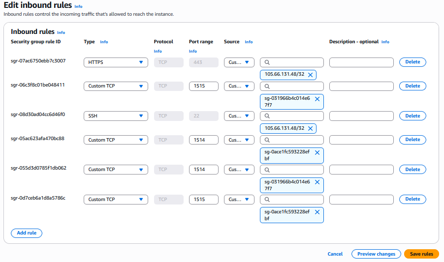
```bash
# SSH depuis IP administrateur
Type: SSH, Port: 22, Source: 105.66.131.48/32

# HTTPS Dashboard depuis IP administrateur
Type: HTTPS, Port: 443, Source: 105.66.131.48/32

# Communication agents
Type: Custom TCP, Port: 1514-1515, Source: Linux-Client-SG, Windows-Client-SG
```

**2. Linux-Client-SG**


```bash
# SSH depuis IP administrateur uniquement
Type: SSH, Port: 22, Source: 105.66.131.48/32
```

**3. Windows-Client-SG**

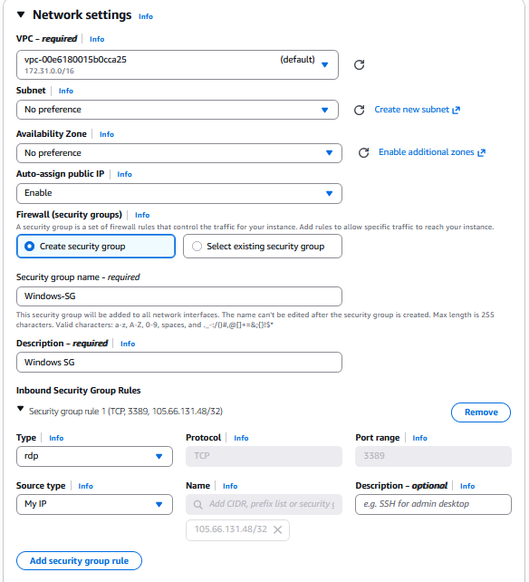
```bash
# RDP depuis IP administrateur uniquement
Type: RDP, Port: 3389, Source: 105.66.131.48/32
```

---

##  Déploiement de l'infrastructure

### Phase 1: Création des instances EC2

#### Instance 1: Wazuh-Server

1. Dans le menu de gauche, cliquer sur **Instances**
2. Cliquer sur le bouton **Launch instances**
3. **Configuration de l'instance :**
   - **Nom :** `Wazuh-Server`
   - **Image :** Ubuntu Server 22.04 LTS (HVM), SSD Volume Type - 64-bit (x86)
   - **Type d'instance :** t3.large (2 vCPUs, 8 GiB RAM)
   - **Paire de clés :**
     - Créer une nouvelle clé : `wazuh-key`
     - Type : RSA
     - Format : .pem

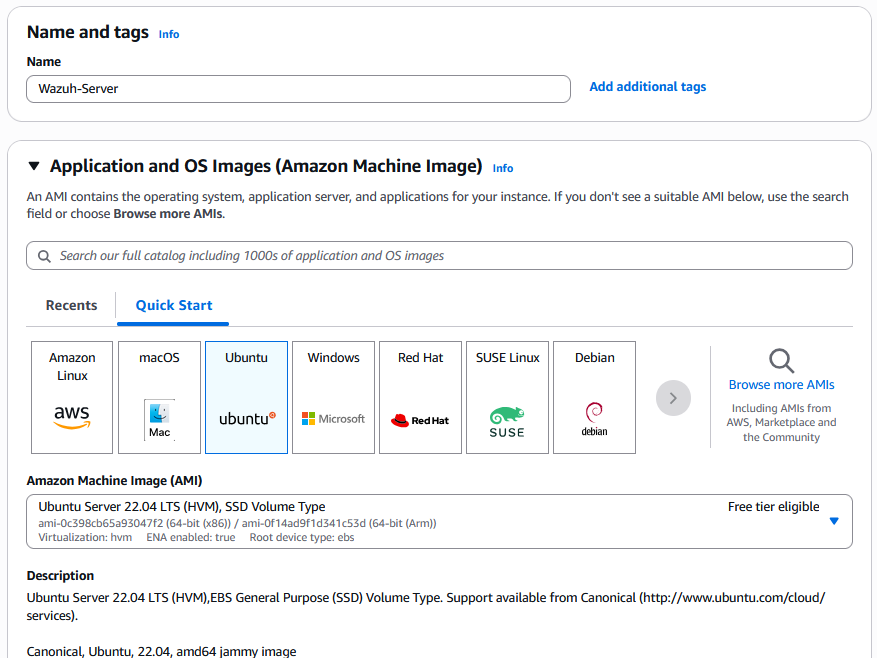
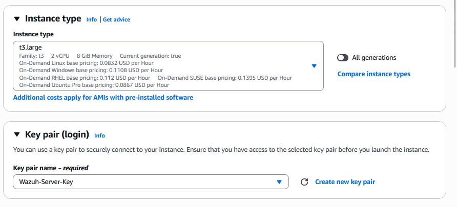

#### Instance 2: Linux-Client

1. Cliquer sur **Launch instances**
2. **Configuration :**
   - **Nom :** `Linux-Client`
   - **Image :** Ubuntu Server 22.04 LTS - 64-bit (x86)
   - **Type d'instance :** t2.micro (1 vCPU, 1 GiB RAM)
   - **Paire de clés :** Sélectionner `wazuh-key`
   - **Security Group :** Créer `Linux-Client-SG` avec règle SSH (port 22, My IP)
   - **Stockage :** 8 GiB gp2


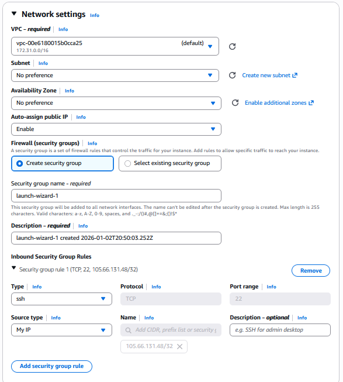

#### Instance 3: Windows-Client

1. Cliquer sur **Launch instances**
2. **Configuration :**
   - **Nom :** `Windows-Client`
   - **Image :** Microsoft Windows Server 2022 Base - 64-bit (x86)
   - **Type d'instance :** t2.medium (2 vCPUs, 4 GiB RAM)
   - **Paire de clés :** Sélectionner `wazuh-key`
   - **Security Group :** Créer `Windows-Client-SG` avec règle RDP (port 3389, My IP)
   - **Stockage :** 30 GiB gp2

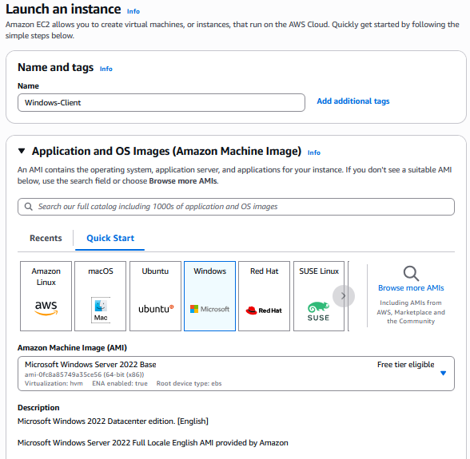

### Phase 2: Installation du serveur Wazuh

#### Connexion SSH au serveur

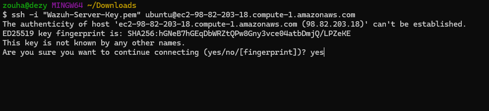

#### Mise à jour du système

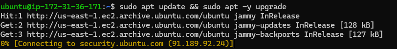
```bash
sudo apt update && sudo apt upgrade -y
```

#### Téléchargement et installation de Wazuh

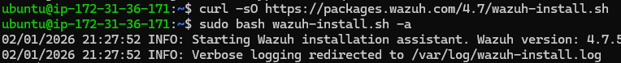
```bash
curl -sO https://packages.wazuh.com/4.14/wazuh-install.sh
sudo bash ./wazuh-install.sh -a
```

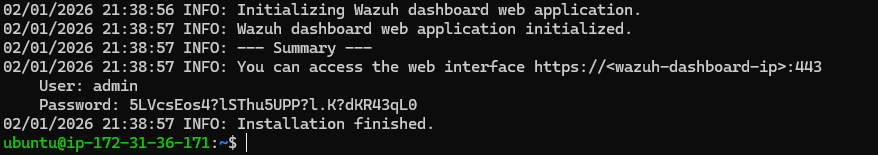

#### Vérification des services

**Wazuh Indexer (base de données) :**


```bash
sudo systemctl status wazuh-indexer
```

**Wazuh Manager (serveur central) :**

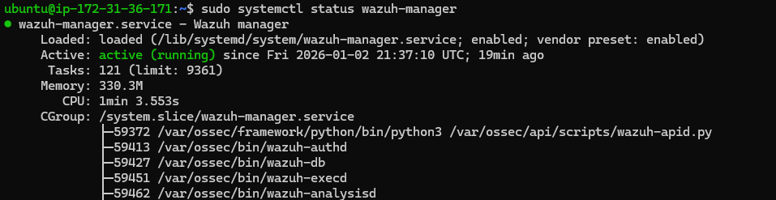
```bash
sudo systemctl status wazuh-manager
```

**Wazuh Dashboard (interface web) :**


```bash
sudo systemctl status wazuh-dashboard
```

#### Accès au Dashboard Wazuh

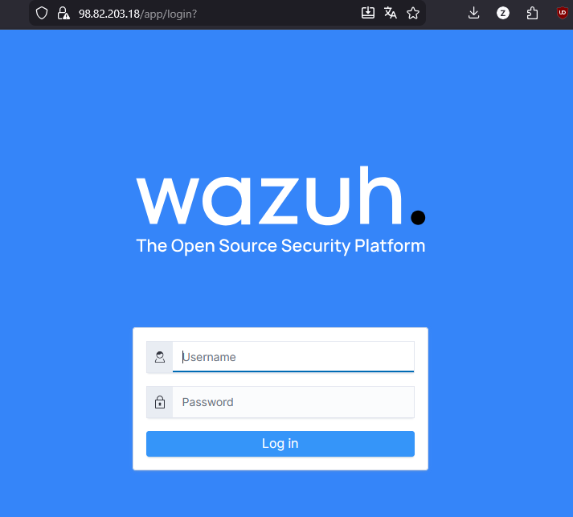

**Identifiants :**
- **Username :** admin
- **Password :** [Le mot de passe donné en terminal]

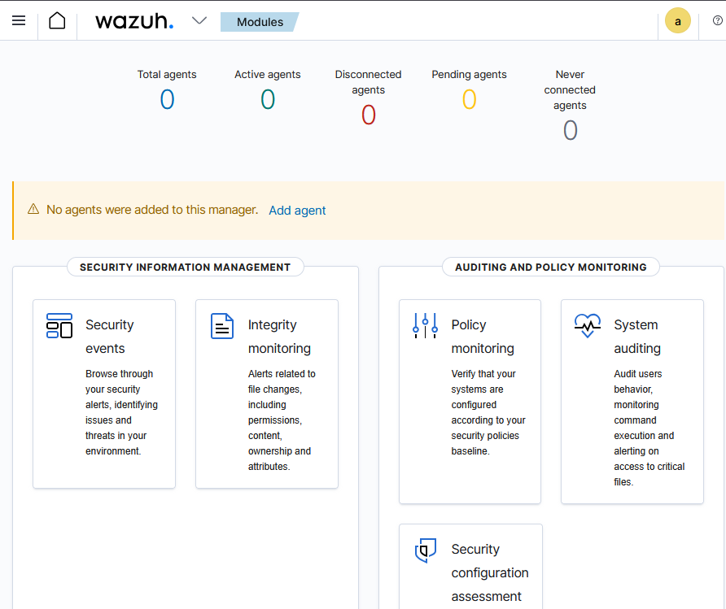

---

##  Enrôlement des clients

### Enrôlement du client Linux

1. Dans le Dashboard, cliquer sur **Deploy new agent**
2. **Configuration de l'agent :**
   - **Operating system :** DEB amd64 (Ubuntu)
   - **Server address :** IP privée du serveur Wazuh (`172.31.36.171`)
   - **Agent name :** Linux-Client
   - **Agent group :** default

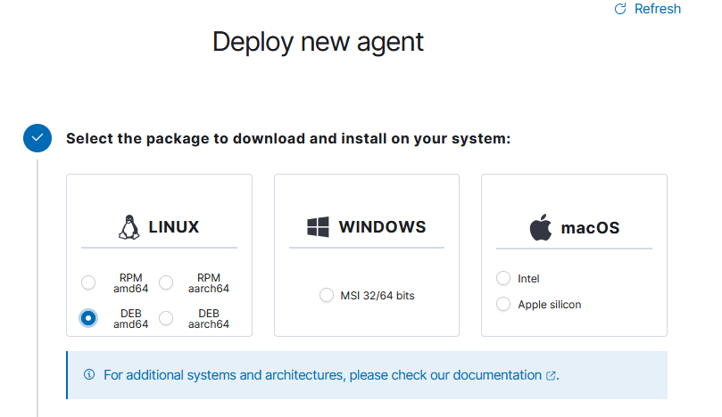

3. Copier et exécuter les commandes sur l'instance Linux-Client

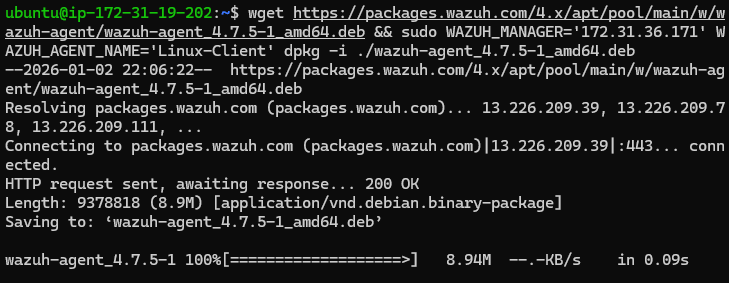
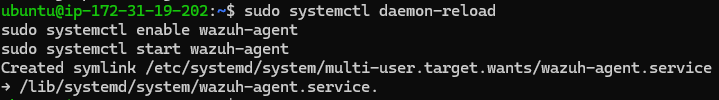
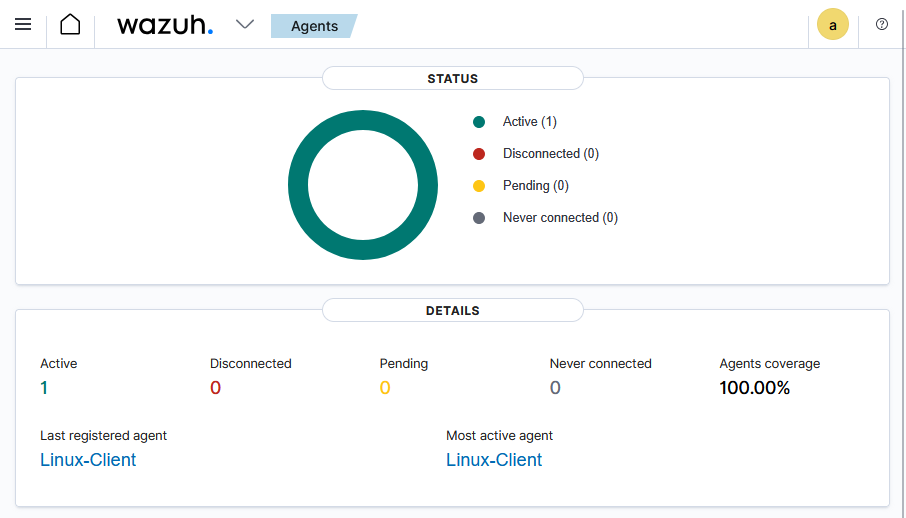

### Enrôlement du client Windows

#### Connexion au client Windows via Bureau à distance

1. **Ouvrir la Connexion Bureau à distance**
   - Appuyez sur la touche **Windows**
   - Tapez `mstsc` ou `Connexion Bureau à distance`
   - Appuyez sur **Entrée**

2. **Se connecter au serveur Windows**
   - Champ **Ordinateur :** IP publique du Windows-Client
   - Cliquez sur **Connecter**

3. **Entrer les identifiants**
   - **Nom d'utilisateur :** Administrator
   - **Mot de passe :** [mot de passe récupéré depuis AWS]

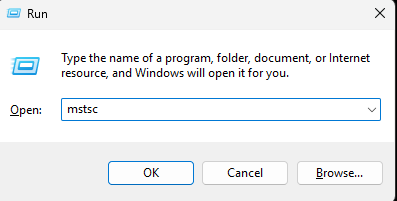
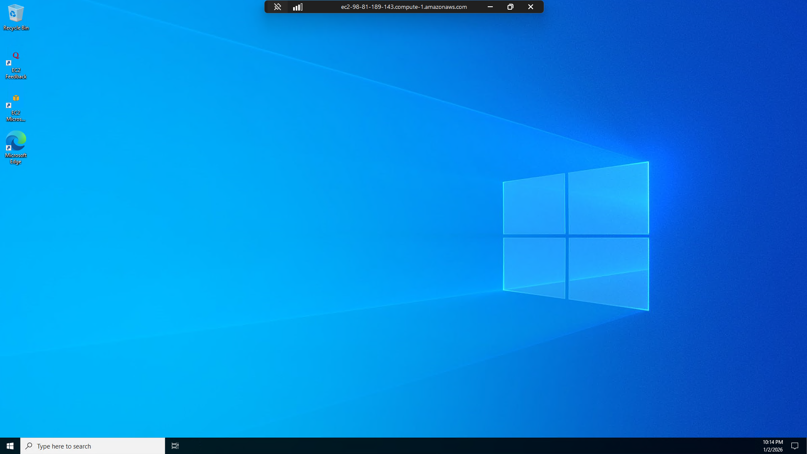

#### Déploiement de l'agent

1. Dans le Dashboard, cliquer sur **Deploy new agent**
2. **Configuration :**
   - **Operating system :** MSI 64-bit (Windows)
   - **Server address :** IP privée du serveur Wazuh (`172.31.36.171`)
   - **Agent name :** Windows-Client


3. Exécuter les commandes dans **PowerShell (Admin)**

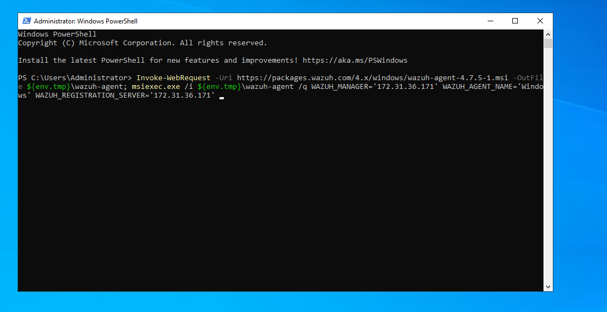
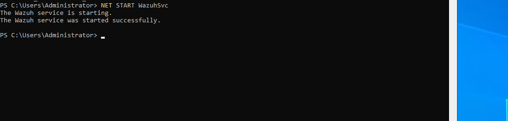
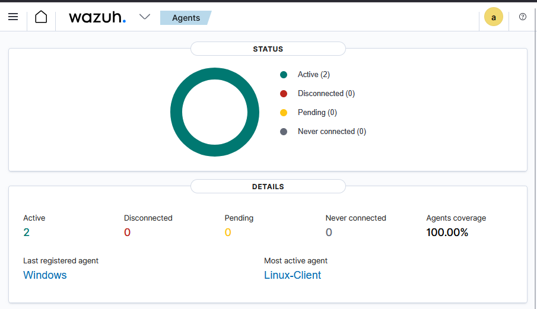

---

##  Démonstrations SIEM et EDR

### Démonstration SIEM côté Linux

#### Scénario 1 — Tentatives SSH échouées (bruteforce simulé)

Plusieurs tentatives de connexion SSH avec des identifiants invalides pour simuler une attaque par force brute :

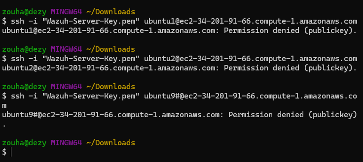

**Résultat observé :** Des alertes de type *authentication failed* ont été générées.

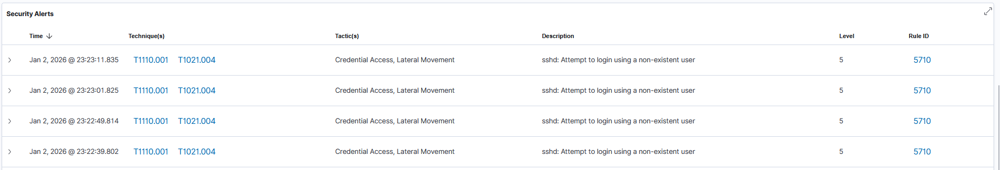

#### Scénario 2 — Élévation de privilèges

Exécution d'une commande d'élévation de privilèges :

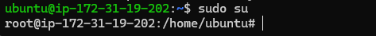

**Résultat observé :** Les événements `sudo` ont été détectés et journalisés.


#### Scénario 3 — Modification d'un fichier sensible (FIM)

Modification volontaire d'un fichier critique du système :

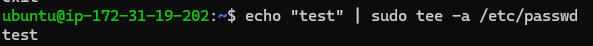

**Résultat observé :** Une alerte de *File Integrity Monitoring* (FIM) a signalé la modification du fichier `/etc/passwd`.

### Démonstration EDR côté Windows

#### Scénario 1 — Échecs de connexion RDP

Plusieurs tentatives de connexion RDP avec un mot de passe incorrect :

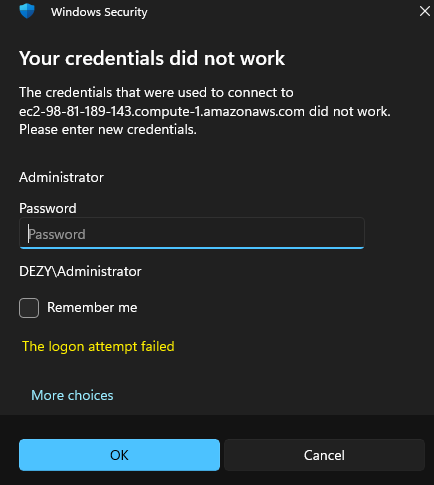

**Résultat observé :** Des événements de sécurité Windows de type *Failed Logon* ont été générés.

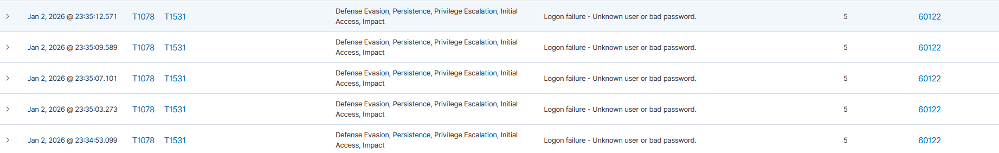

#### Scénario 2 — Création d'un utilisateur local

Création d'un utilisateur local depuis PowerShell en mode administrateur :

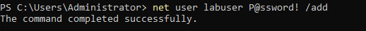
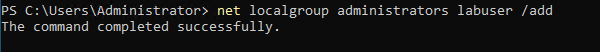

**Résultat observé :** Les événements liés à la création de l'utilisateur et à la modification des groupes ont été détectés.

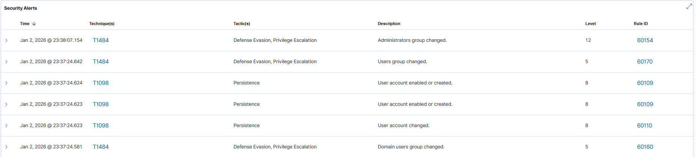

### Visualisation des événements dans le Dashboard

Filtres utilisés pour vérifier la détection des événements :
- Section : **Security events / Threat hunting**
- Filtre par agent : `Windows-Client`
- Filtre par type d'événement : `Windows Security`, `group changed`

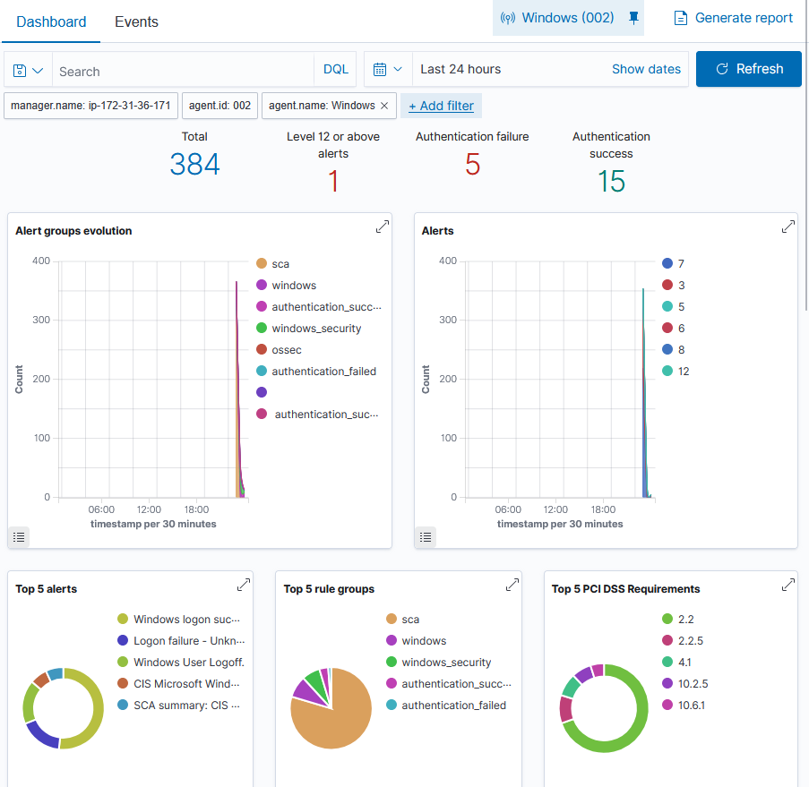
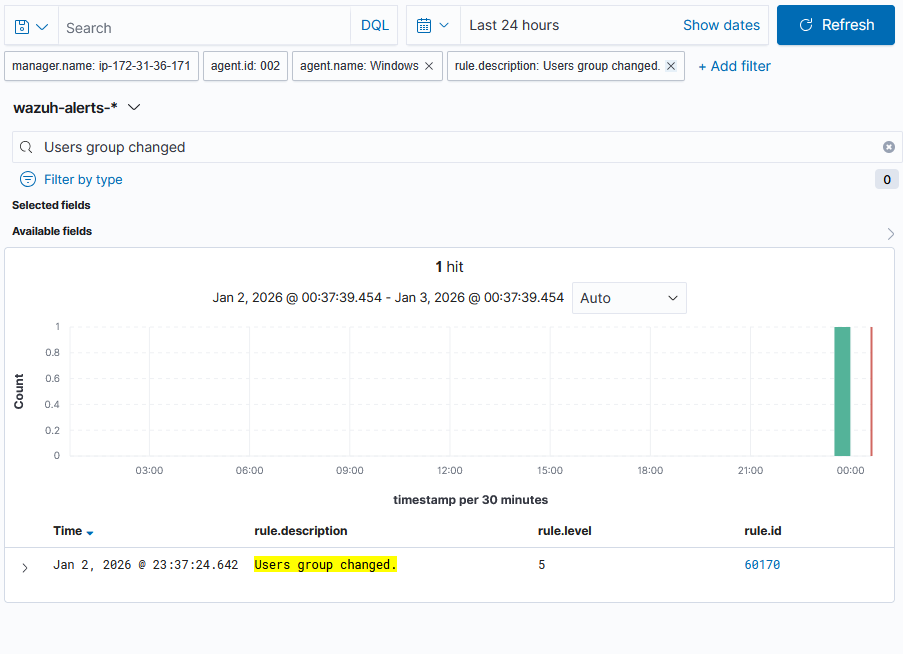

**Résultat observé :** Tous les événements générés ont été correctement collectés et sont visibles dans le Dashboard.

---

##  Conclusion

Ce projet nous a permis de déployer avec succès une infrastructure complète de supervision de sécurité combinant SIEM et EDR à travers la solution Wazuh sur AWS. Nous avons acquis une compréhension pratique et opérationnelle du fonctionnement d'un SOC moderne, en couvrant trois axes majeurs de la cybersécurité : l'Endpoint Security, l'Identity and Access Management et le Threat Detection.

Cette expérience constitue une base solide pour comprendre les enjeux de la cyberdéfense en entreprise. La combinaison d'une plateforme centralisée (SIEM) et d'une surveillance granulaire des endpoints (EDR) s'avère essentielle pour maintenir une posture de sécurité efficace face aux menaces actuelles. Les compétences en Threat Hunting développées complètent utilement les approches de détection automatique, illustrant qu'un SOC efficace repose autant sur les outils que sur l'expertise humaine.

---

**Date :** 03 Janvier 2026  
**Plateforme :** AWS Learner Lab  
**Solution :** Wazuh 4.14
**ZOUHARI Dyae errahmane** all rights reserved
